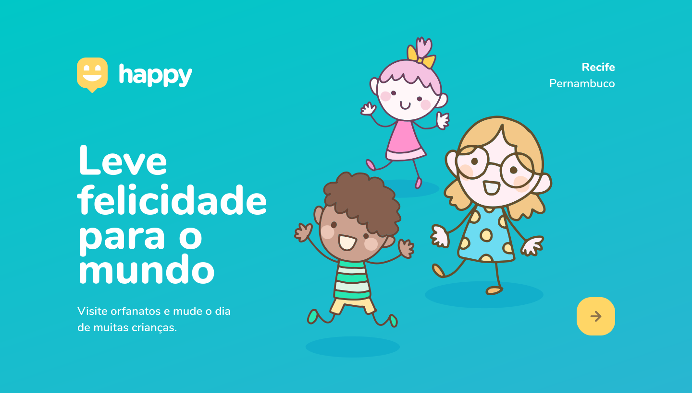

<h1 align="center">
    
</h1>

- [About](#about)
- [NLW](#nlw)
- [Pre-Requirements](#requirements)
- [How to run](#how-to-run)
- [Credits](#credits)
- [License](#license)

<p align="center"></p>

## About

Happy is an application that connects people to orphanages to make many children's day happier

## NLW
**Next Level Week** is a online event organized by [Rocketseat](https://rocketseat.com.br)

## Pre-Requirements

- [Node.js](https://nodejs.org/en)

## How to Run

- Download or clone the project

    - [Download](https://github.com/JoaoFelipeFlorencio/NLW3/archive/master.zip)
    - Clone using the following command
        ```bash
            git clone https://github.com/JoaoFelipeFlorencio/NLW3.git
        ```
- Go to the project directory
- Install dependencies
    ```bash
        npm install
    ```
- Start the application
    ```bash
        npm start

        # The application will start at the port: 5500 - acess <http:localhost:5500>
    ```

## Credits
- [@rocketseat](https://github.com/Rocketseat)

## License

This project is under the following license [MIT](./LICENSE)